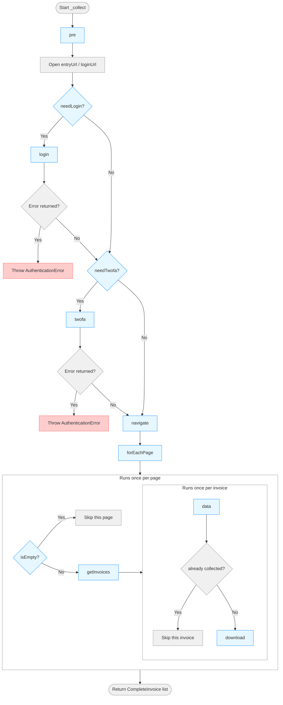

# Web collector

This guide explains how to build a new **Web Collector**.

## 1. File location

Your collector should live in `src/collectors/community/mycollector/`.

```
src
└─ collectors
    └─ community
        └─ mycollector
            └─ mycollector.ts
            └─ selectors.ts
```

 The folder name and filename must match the collector's `CONFIG.id` (e.g. `mycollector.ts` for `CONFIG.id = "mycollector"`).

## 2. Class hierarchy

```
AbstractCollector
 └─ WebCollector            (browser lifecycle: Driver, proxy, cookies, screenshots...)
      └─ LinearWebCollector (the orchestration logic described in this guide)
           └─ YourCollector (what you actually write)
```

`LinearWebCollector` implements a single template method, `_collect(...)`, that drives a **browser session** through login, 2FA, navigation, and invoice extraction. Your job is only to override a handful of **hook methods**. Everything else (state updates, websocket progress, error screenshots, cookie persistence, retry logic) is handled for you.

```typescript
export class MyCollector extends LinearWebCollector {
    ...
}
```

## 3. The `config` object

Every collector declares a static `CONFIG` describing itself, the credential form, and the two key URLs:

```ts
static CONFIG = {
    id: "mycollector",                                      // unique identifier for this collector
    name: "My Collector",                                   // human-readable name
    description: "i18n.collectors.mycollector.description", // i18n key for a longer description
    version: "1",                                           // version of this collector, used for cache invalidation
    website: "https://my.collector.com",                    // URL to the service's website
    logo: "https://.../logo.svg",                           // URL to a logo for this collector, prefer svg logo
    type: CollectorType.WEB,                                // always WEB for LinearWebCollector
    params: {                                               // rendered as a login form
        email:    { type: "string",   name: "i18n...", mandatory: true },
        password: { type: "password", name: "i18n...", mandatory: true },
    },
    loginUrl: "https://my.collector.com/login",             // page where the login form is located
    entryUrl: "https://my.collector.com/account/invoices",  // page where invoices are listed
    captcha: CollectorCaptcha.NONE,                         // specifies whether the collector has a captcha on the login page (NONE, RECAPTCHA_V2, RECAPTCHA_V3)
    authenticationMethod: CollectorAuthenticationMethod.ALL // specifies whether the collector is compatible with interactive login, secrets, or both (INTERACTIVE, SECRETS, ALL)
}
```

## 4. Constructor

You just have to pass the `CONFIG` to the parent constructor. It makes sure the config is valid and sets up the collector's internal state.
```ts
constructor() {
    super(MyCollector.CONFIG);
}
```

## 5. Hooks and collect pipeline

A collect can be read as a small functional pipeline, where each step is a hook method you can override. The default implementations are provided by `LinearWebCollector` and can be overridden if the default behavior isn't suitable.:



### `pre` (optional)
Runs before anything else (before url is even opened). Rarely overridden;

### `needLogin` (optional)
Default (from `LinearWebCollector`):
```ts
// If entryUrl is undefined or the current URL doesn't include entryUrl (redirected to login page), we need to log in.
return this.config.entryUrl == undefined || !driver.url().includes(this.config.entryUrl);
```
Override when the URL check isn't reliable enough. You can use an element on screen to detect whether the user is logged in or not:
```ts
async needLogin(driver: Driver): Promise<boolean> {
    return driver.getElement(Selectors.CONTAINER_LOGGEDIN_ACCOUNT, { raiseException: false, timeout: 1000 }) == null;
}
```
Or look for a specific URL pattern:
```ts
async needLogin(driver: Driver): Promise<boolean> {
    return driver.url().includes("login");
}
```

### `login` (mandatory)
Fill the credential form and submit it. `params` contains whatever fields you declared in `CONFIG.params` (e.g. `params.email`, `params.password`). **Return a string** (an i18n error key) if login failed — returning nothing means success. `LinearWebCollector` turns a returned string into an `AuthenticationError` for you.

```ts
async login(driver: Driver, params: any): Promise<string | void> {
    await driver.inputText(Selectors.FIELD_IDENTIFIER, params.email);
    await driver.inputText(Selectors.FIELD_PASSWORD, params.password);
    await driver.leftClick(Selectors.BUTTON_SUBMIT);

    const alert = await driver.getElement(Selectors.CONTAINER_LOGIN_ALERT, { raiseException: false, timeout: 2000 });
    if (alert) {
        return await alert.textContent("i18n.collectors.all.password.error");
    }
}
```

### `needTwofa` (optional)
Needed if the website implements **two-factor authentication**. Return a string (an i18n instruction key) if 2FA is required, or nothing if not. `LinearWebCollector` will then wait for the user to provide a code (via the UI or a websocket) and call your `twofa` method.
```ts
async needTwofa(driver: Driver): Promise<string | void> {
    // Check if 2FA is required
    const twofa_instruction = await driver.getElement(Selectors.CONTAINER_2FA_INSTRUCTIONS, { raiseException: false, timeout: 1000 });
    if (twofa_instruction) {
        return await twofa_instruction.textContent("i18n.collectors.all.2fa.instruction");
    }
}
```

### `twofa` (optional)
Only needed if `needTwofa` can return something. Waits for the user-provided code (from the UI or an automatic websocket source), submits it, and returns an i18n error string on failure:
```ts
const twofa_code = await Promise.race([twofa_promise.code(), webSocketServer.getTwofa()]);
await driver.inputText(Selectors.FIELD_2FA_CODE, twofa_code);
await driver.leftClick(Selectors.BUTTON_2FA_SUBMIT);
```

### `navigate` (optional)
Runs once, after authentication, to move the browser from `entryUrl` to wherever invoices actually live. Free Mobile clicks a button to reveal the invoice list:
```ts
async navigate(driver: Driver): Promise<void> {
    await driver.leftClick(Selectors.BUTTON_SHOW_INVOICES, { navigation: false });
}
```

### `forEachPage` (optional)
Controls **pagination**. Call `await next()` once per page you want scanned; everything inside `next()` (isEmpty → getInvoices → data → download) runs again for that page. Default: call `next()` exactly once (no pagination).

Free Mobile uses a "load more" button pattern:
```ts
async forEachPage(driver: Driver, next: () => Promise<void>): Promise<void> {
    await driver.leftClick(Selectors.BUTTON_MORE_INVOICES, { raiseException: false, timeout: 1000, navigation: false });
    await driver.leftClick(Selectors.BUTTON_MORE_INVOICES, { raiseException: false, timeout: 1000, navigation: false });
    await driver.leftClick(Selectors.BUTTON_MORE_INVOICES, { raiseException: false, timeout: 1000, navigation: false });
    await next();
}
```
Amazon iterates real pages across two years, discovering extra pages via pagination links:
```ts
async forEachPage(driver: Driver, next: () => Promise<void>): Promise<void> {
    const currentYear = new Date().getFullYear();
    for (let year = currentYear; year >= currentYear - 1; year--) {
        await driver.goto(`https://www.amazon.fr/your-orders/orders?timeFilter=year-${year}`);
        await next();   //Handle first page of the year

        const pages = await driver.getAttributes(Selectors.BUTTON_PAGE, "href", { raiseException: false, timeout: 100 }) ?? [];
        // For each other pages
        for (const page of pages) {
            await driver.goto(driver.origin() + page);
            await next();
        }
    }
}
```

### `isEmpty` (optional)
Return `true` to **skip** the current page entirely (no orders/invoices found). Default: always `false`. Amazon checks for a "no orders" placeholder element:
```ts
async isEmpty(driver: Driver): Promise<boolean> {
    return await driver.getElement(Selectors.CONTAINER_NO_ORDERS, { raiseException: false, timeout: 100 }) != null;
}
```

### `getInvoices` (mandatory)
Return one DOM `Element` per invoice/order row on the current page. If this returns an empty array (and `isEmpty` said the page wasn't empty), `LinearWebCollector` treats it as a broken selector and throws `NoInvoiceFoundError`.
```ts
async getInvoices(driver: Driver): Promise<Element[]> {
    return await driver.getElements(Selectors.CONTAINER_INVOICES);
}
```

### `data` (mandatory)
Turn one row `Element` into an `Invoice`: `{ id, timestamp, amount, link, metadata?, downloadButton? }`. Return `null` to silently discard a row (e.g. cancelled order, invoice not yet available). `id` gets sanitized automatically afterward (illegal filename characters stripped).

```ts
async data(driver: Driver, element: Element): Promise<Invoice | null> {
    const link = driver.url();
    const id = await element.getAttribute(Selectors.CONTAINER_INVOICE_ID, "textContent");
    const stringDate = await element.getAttribute(Selectors.CONTAINER_INVOICE_DATE, "textContent");
    const amount = await element.getAttribute(Selectors.CONTAINER_INVOICE_AMOUNT, "textContent");
    const downloadButton = await element.getElement(Selectors.BUTTON_INVOICE_DOWNLOAD);

    return {
        id,
        link,
        timestamp: utils.timestampFromString(stringDate, 'MMMM yyyy', 'en'),
        amount,
        downloadButton: downloadButton
    };
}
```

### `download` (mandatory)
Given an `Invoice`, return an array of **base64-encoded documents**. Most collectors return a single document, but some invoices are split across several PDFs (hence an array). Use the inherited helpers:
- `this.download_link(driver, url)` — downloads a direct file URL.
- `this.download_webpage(driver, url)` — prints a webpage to PDF and downloads it.

Free Mobile (single link):
```ts
async download(driver: Driver, invoice: Invoice): Promise<string[]> {
    return [await this.download_link(driver, invoice.link)];
}
```

If more than one document is produced per invoice and `DocumentStrategy.MERGE` is configured, `LinearWebCollector` automatically merges them into a single PDF for you; the default strategy is `SPLIT` (one row per document).

## 6. Minimal skeleton

```ts
export class MyCollector extends LinearWebCollector {

    static CONFIG = {
        id: "mycollector",
        name: "My Collector",
        description: "i18n.collectors.mycollector.description",
        version: "1",
        website: "https://my.collector.com",
        logo: "https://.../logo.svg",
        type: CollectorType.WEB,
        params: {
            email:    { type: "string",   name: "i18n.collectors.all.identifier", mandatory: true },
            password: { type: "password", name: "i18n.collectors.all.password",   mandatory: true },
        },
        loginUrl: "https://my.collector.com/login",
        entryUrl: "https://my.collector.com/account/invoices",
        captcha: CollectorCaptcha.NONE,
        authenticationMethod: CollectorAuthenticationMethod.ALL
    }

    constructor() {
        super(MyCollector.CONFIG);
    }

    async login(driver: Driver, params: any): Promise<string | void> {
        // TODO: Perform login
        // Return string if error displayed
    }

    async getInvoices(driver: Driver): Promise<Element[]> {
        // TODO: Get all invoice rows on the current page
        // Return one Element per invoice row
    }

    async data(driver: Driver, element: Element): Promise<Invoice | null> {
        // TODO: Extract invoice data from the row element
        // Return null to skip this invoice
    }

    async download(driver: Driver, invoice: Invoice): Promise<string[]> {
        //TODO: Download the invoice document(s)
        // Return an array of base64 strings
    }
}
```

`login`, `getInvoices`, `data`, and `download` are the only methods you **must** implement — `pre`, `needLogin`, `needTwofa`, `twofa`, `navigate`, `forEachPage`, and `isEmpty` all have sensible defaults in `LinearWebCollector` and can be left out if the target site doesn't need them.

-----------

Great job! You now have created your first web collector. The next step is to **test** it. See [Testing a Collector](../testing_collector.md) for instructions.
