# Overview

## Introduction

Invoice Collector is an open-source, Docker-based tool designed to streamline the process of collecting invoices from various sources such as emails, websites, and APIs. This tool is intended to be self-hosted by clients, providing a flexible and secure solution for managing invoices efficiently.

## Benefits

- **Privacy**: Self-hosting ensures that sensitive data such as credentials, passwords and financial data remains within your private network, reducing the risk of data breaches.
- **Transaparency**: The open-source nature of Invoice-Collector ensures complete transparency. Users can inspect the code, understand how the tool works, and verify that it meets their security and compliance requirements. This transparency builds trust between us and our users. This is extremly important when manipulating sensitive datas.
- **Scalability**: The Docker-based architecture allows for easy scaling, making it suitable for businesses of all sizes, from small startups to large companies.
- **Community**: Being open source, Invoice-Collector benefits from a community of users and developers who contribute to its improvement and provide support.

## How it works

Here is how Invoice-Collector fits in your infrastructure:

- **User**: Represents the machine requesting collects and retrieving the results. It is composed of a _Requestor_ and a _Handler_.
- **Requestor**: Requests a collect to the _Invoice-Collector_ container. The action is queued and is not immediatly performed.
- **Invoice-Collector Container**: Our docker container performs the collection requested by the _Requestor_ and sends the invoices to the _Handler_ once done. Successes and errors are loged to the _Invoice-Collector Server_
- **Handler**: Receives the invoices, or an error if something went wrong.
- **Invoice-Collector Server**: Receives the logs from the running containers. This server is only used to maintain collectors and fix bugs.

:::info[IMPORTANT]
Credentials and tokens are never sent to the **Invoice-Collector Server**. Sensitive datas never leave your infrastructure.
:::
