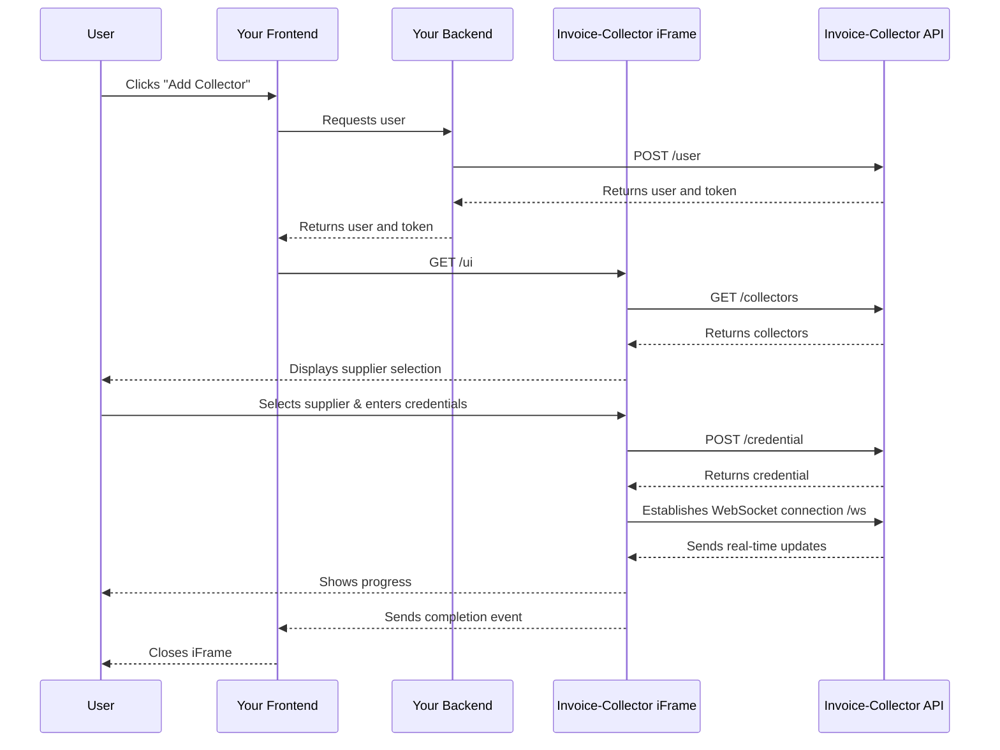
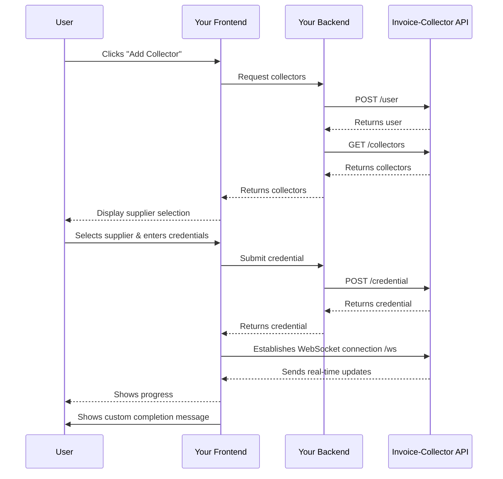

import Button from '@site/src/components/Button';
import Tabs from '@theme/Tabs';
import TabItem from '@theme/TabItem';

# 2. Add a credential

Invoice-Collector offers two flexible integration approaches to the credential addition process.
Whether you prefer a quick, embedded solution or full control over the user experience, we have you covered.

## Comparison Table

| Feature | iFrame Integration | Full API Integration |
|---------|-------------------|----------------------|
| **Setup Time** | 48 hours | 2 weeks |
| **Customization** | Limited (CSS theming) | Complete control |
| **Maintenance** | Automatic | Manual updates needed |
| **API Calls** | Handled internally | You manage all calls |
| **WebSocket Management** | Automatic | You implement |
| **UI Consistency** | Invoice-Collector branded | Your brand |
| **Technical Complexity** | Low | Medium to High |
| **Best For** | Quick implementation | Custom experiences |

---

## 1. Iframe integration (Quick & Easy)

The iFrame integration is the fastest way to add Invoice-Collector to your application.
With this approach, the credential addition process is embedded in our pre-built interface.
All the complex API interactions are handled automatically within the iframe, especialy the WebSocket connection and events handling.

**Key Benefits:**
- ⚡ **Fastest integration** - Get up and running in minutes
- 🔒 **Secure by default** - Credentials never pass through your frontend
- 🎨 **Pre-built UI** - No need to design credential collection forms
- 🔄 **Automatic updates** - Always get the latest features and collectors
- 📱 **Responsive design** - Works seamlessly on all devices

**How it works:**



**What you need to implement:**
- Backend:
    - Call `POST /user` to create a user in our database and get the user token
- Frontend:
    - Create a hidden iframe tag in your Frontend. This iframe will be displayed when needed.

**Perfect for:**
- MVPs and rapid prototyping
- Teams with limited frontend resources
- Applications that want to minimize maintenance
- Projects prioritizing time-to-market

### Events from Iframe to parent

In order to integrate the iframe seamlessly in your frontend, our iframe send events to your frontend to notify what panel is currently displayed in the iframe.
These events can be used to adapt the size of the iframe during the credential addition process.

Here is how events are sent from iframe:

```javascript
window.parent.postMessage(NAVIGATION_EVENT_CLOSE, '*');
```

Here are the possible events:

| Name | Format | Description | Embedding |
|---|---|---|---|
| Close | `{ type: 'ic-close' }` | The credential addition process in finished. The iframe can be closed |  |
| Panel Search | `{ type: 'ic-panel-search' }` | Current panel is "Search". User can search for a collector in the list. |  |
| Panel Form | `{ type: 'ic-panel-form' }` | Current panel is "Form". User inputs are asked in a form.  |  |
| Panel Feedback | `{ type: 'ic-panel-feedback' }` | Current panel is "Feedback". A small feedback form is displayed. |  |
| Panel Progress | `{ type: 'ic-panel-progress' }` | Current panel is "Progress". Credential collect is in progress. |  |
| Panel Canvas | `{ type: 'ic-panel-canvas' }` | Current panel is "Canvas". User needs to authenticate using video stream. |  |

In the parent application, here is how the events can be catch:

```javascript
window.addEventListener('message', function(event) {
    //Message received from an iframe

    // If event comes from Invoice-Collector
    if (event.origin === "https://api.invoice-collector.com") {
        if (event.data.type === 'ic-close') {
            //Close the iframe
        }
        else if (event.data.type === 'ic-panel-search') {
            //Panel "Search" is displayed
            //Recommended: Resize the iframe to full screen (eg: 100%, 100%)
        }
        else if (event.data.type === 'ic-panel-form') {
            //Panel "Form" is displayed
            //Recommended: Resize the iframe to full screen (eg: 100%, 100%)
        }
        else if (event.data.type === 'ic-panel-progress') {
            //Panel "Progress" is displayed
            //Recommended: Resize the iframe to small size (eg: 500px, 500px)
        }
        else if (event.data.type === 'ic-panel-canvas') {
            //Panel "Canvas" is displayed
            //Recommended: Resize the iframe to big size (eg: 1200px, 600px)
        }
        else if (event.data.type === 'ic-panel-feedback')
            //Panel "Progress" is displayed
            //Recommended: Resize the iframe to small size (eg: 600px, 600px)
        }
    } else {
        //Event origin is not Invoice-Collector
    }
});
```

---

## 2. Full integration (Complete Control)

The Full API integration gives you complete control over the user experience. Build your own interface while leveraging our powerful backend infrastructure for credential management and invoice collection.

**Key Benefits:**
- 🎨 **Full UI customization** - Design matches your brand perfectly
- 🔧 **Maximum flexibility** - Control every aspect of the user flow
- 📊 **Custom analytics** - Track user interactions your way
- 🌐 **Multi-platform** - Reuse logic across web, mobile, and desktop

**How it works:**



**What you need to implement:**
- Backend:
    - Call `POST /user` to create a user in our database and get the user
    - Call `GET /collectors` to list all the available collectors
    - Call `POST /user/{user_id}/credential` to create a new credential
- Frontend:
    - Create a page to display all the available collectors
    - Create a page to ask for credentials
    - Create a page to display addition progress
    - Implement WebSocket connection `/ws` and events (state, screenshot, twofa, close)

**Perfect for:**
- Enterprise applications with specific branding requirements
- Teams with strong frontend capabilities
- Applications requiring deep integration with existing workflows
- Projects needing custom validation or user guidance

### WebSocket connection

When implementing the Full API integration, you'll need to establish a WebSocket connection to receive real-time updates about the credential collection process.

#### Messages Received from API

**State** message is received on connection and everytime the collection state changes. 
IT is used to update the progress bar and be notified when the collect is finished.

```typescript
type MessageState = {
    type: 'state';
    state: {
        index: 1; // Number between -2 and 7
        max: 7;
        title = "State title";
        message = "State message";
    }
}
```

**Screenshot** message is received when the user needs to login using the video stream.
Screenshot messages are sent approximately every 50ms during interactive login (`state.index = 2`):

```typescript
type MessageScreenshot = {
    type: 'screenshot';
    screenshot: string;  // Base64 encoded image
    width: number;       // Screenshot width in pixels
    height: number;      // Screenshot height in pixels
}
```

#### Messages Sent to API

**Twofa** message must be sent when `state.index = 3`.
This code must be asked in your frontend.

```typescript
type MessageTwofa = {
    type: 'twofa';
    twofa: string;  // The 2FA code from the user
}
```

**Click** message can be sent when `state.index = 2` and at least one screenshot has been received.
It simulates a click on the screenshot:

```typescript
type MessageClick = {
    type: 'click';
    x: number;  // X coordinate as percentage (0-100) of screenshot width
    y: number;  // Y coordinate as percentage (0-100) of screenshot height
}
```

**Keydown** message can be sent when `state.index = 2` and at least one screenshot has been received.
It simulates a keydown event:

```typescript
type MessageKeydown = {
    type: 'keydown';
    key: string;  // Key name (e.g., 'Enter', 'Backspace', 'A', 'b', '?')
}
```

**Text** message can be sent when `state.index = 2` and at least one screenshot has been received.
It simulates a paste (Ctrl+V) event:

```typescript
type MessageText = {
    type: 'text';
    text: string;  // The text to input
}
```

**Close** message can be sent when `state.index = 2` and at least one screenshot has been received.
It notifies that login process has been performed with screenshot.
You will stop receiving `screenshot` events.

```typescript
type MessageClose = {
    type: 'close';
    reason: 'ok' | 'cancel' | 'report';
}
```

- `ok` - Login completed successfully, collect can continue
- `cancel` - User cancelled the process
