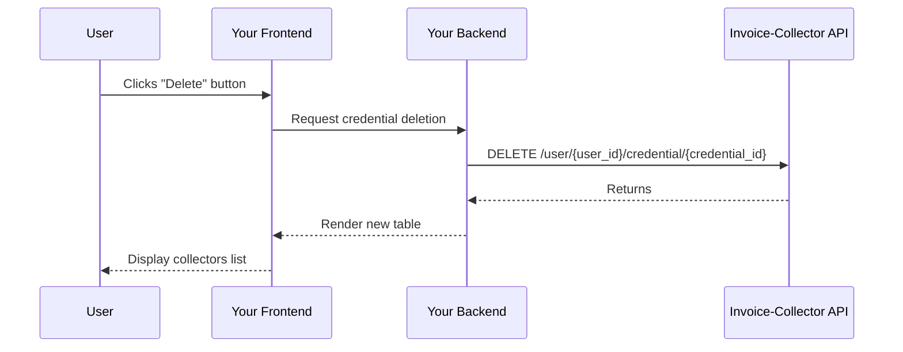

import Button from '@site/src/components/Button';

# 5. Delete a credential

When a user wants to delete a credential from your app, he can click on the Delete button in the table.

### Implementation

<table>
    <thead>
        <tr>
            <th>Step</th>
            <th>Side</th>
            <th>Description</th>
        </tr>
    </thead>
    <tbody>
        <tr>
            <td>1</td>
            <td>Frontend</td>
            <td>User clicks on the `Delete` button in the table.</td>
        </tr>
        <tr>
            <td>2</td>
            <td>Backend</td>
            <td>Delete credential with endpoint [`DELETE /user/{user_id}/credential/{credential_id}`](/docs/api.mdx#tag/Credential-(bearer)/paths/~1user~1{user_id}~1credential~1{credential_id}/delete).</td>
        </tr>
        <tr>
            <td>3</td>
            <td>Frontend</td>
            <td>Update credentials table.</td>
        </tr>
    </tbody>
</table>

### How it works

