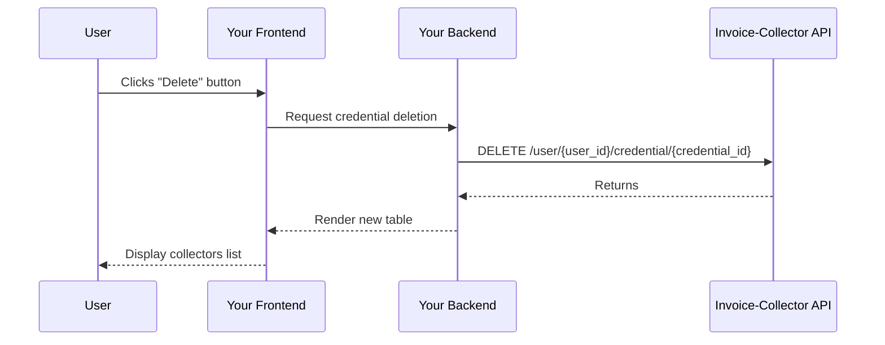

import Button from '@site/src/components/Button';

# 3. Delete a Credential

When a user wants to delete a collector/credential from your app, he can click on the Delete button in the table.

Flow:
1. User click on the `Delete` button in the table
2. Delete credential with endpoint `DELETE /user/{user_id}/credential/{credential_id}`
3. Update credential from table

