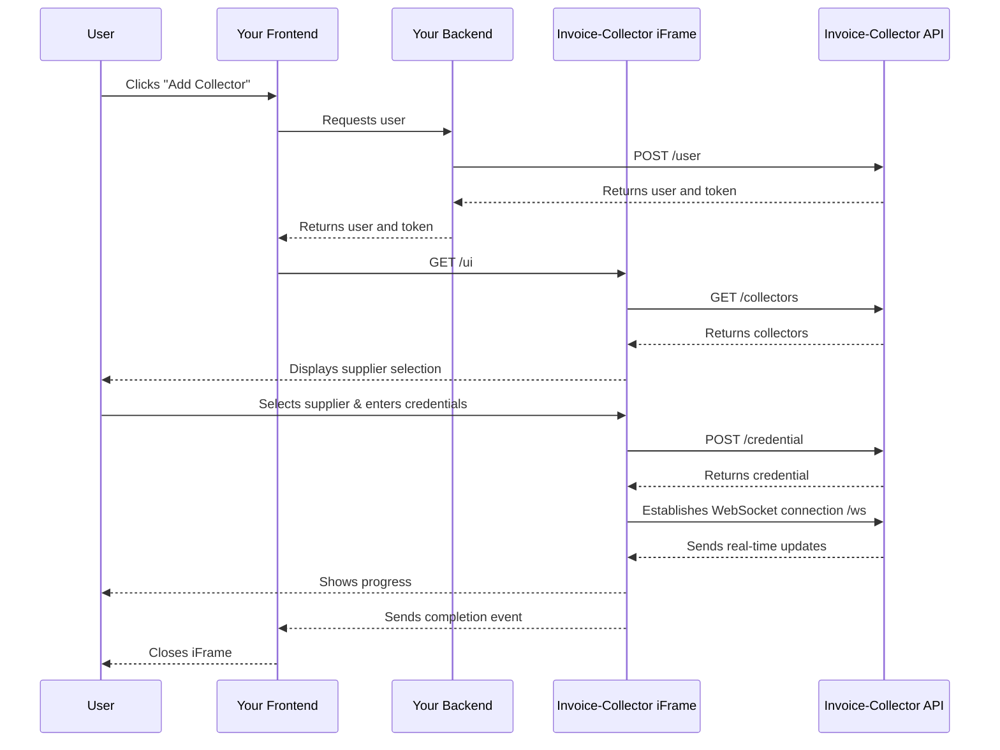
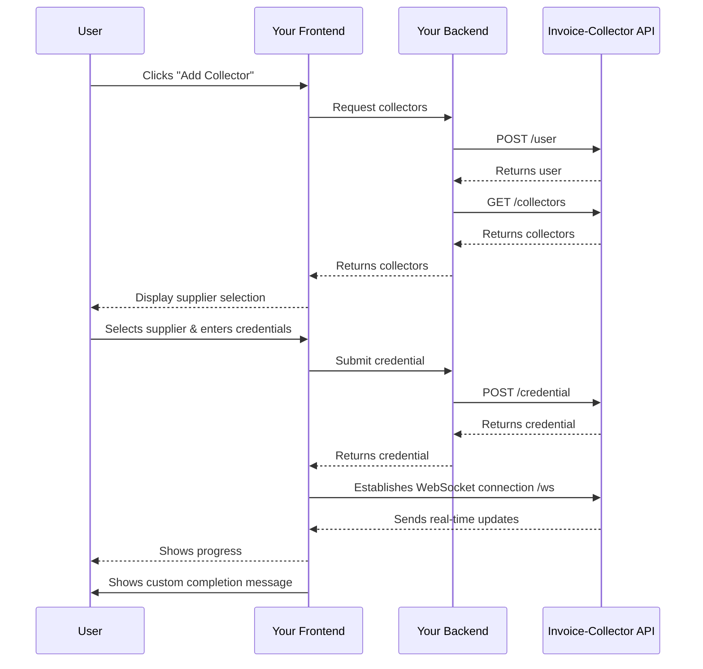

import Button from '@site/src/components/Button';
import Tabs from '@theme/Tabs';
import TabItem from '@theme/TabItem';

# Introduction

Invoice-Collector offers two flexible integration approaches to suit your application's needs.
Whether you prefer a quick, embedded solution or full control over the user experience, we have you covered.

## Comparison Table

| Feature | iFrame Integration | Full API Integration |
|---------|-------------------|----------------------|
| **Setup Time** | 48 hours | 2 weeks |
| **Customization** | Limited (CSS theming) | Complete control |
| **Maintenance** | Automatic | Manual updates needed |
| **API Calls** | Handled internally | You manage all calls |
| **WebSocket Management** | Automatic | You implement |
| **UI Consistency** | Invoice-Collector branded | Your brand |
| **Technical Complexity** | Low | Medium to High |
| **Best For** | Quick implementation | Custom experiences |

---

### 1. Iframe integration (Quick & Easy)

The iFrame integration is the fastest way to add Invoice-Collector to your application.
With this approach, the credential addition process is embedded in our pre-built interface.
All the complex API interactions are handled automatically within the iframe, especialy the WebSocket connection and events handling.

**Key Benefits:**
- ⚡ **Fastest integration** - Get up and running in minutes
- 🔒 **Secure by default** - Credentials never pass through your frontend
- 🎨 **Pre-built UI** - No need to design credential collection forms
- 🔄 **Automatic updates** - Always get the latest features and collectors
- 📱 **Responsive design** - Works seamlessly on all devices

**How it works:**

**What you need to implement:**
- Backend:
    - Call `POST /user` to create a user in our database and get the user token
- Frontend:
    - Create a hidden iframe tag in your Frontend. This iframe will be displayed when needed.

**Perfect for:**
- MVPs and rapid prototyping
- Teams with limited frontend resources
- Applications that want to minimize maintenance
- Projects prioritizing time-to-market

---

### 2. Full integration (Complete Control)

The Full API integration gives you complete control over the user experience. Build your own interface while leveraging our powerful backend infrastructure for credential management and invoice collection.

**Key Benefits:**
- 🎨 **Full UI customization** - Design matches your brand perfectly
- 🔧 **Maximum flexibility** - Control every aspect of the user flow
- 📊 **Custom analytics** - Track user interactions your way
- 🌐 **Multi-platform** - Reuse logic across web, mobile, and desktop

**How it works:**

**What you need to implement:**
- Backend:
    - Call `POST /user` to create a user in our database and get the user
    - Call `GET /collectors` to list all the available collectors
    - Call `POST /credential` to create a new credential
- Frontend:
    - Create a page to display all the available collectors
    - Create a page to ask for credentials
    - Create a page to display addition progress
    - Implement WebSocket connection `/ws` and events (state, screenshot, twofa, close)

**Perfect for:**
- Enterprise applications with specific branding requirements
- Teams with strong frontend capabilities
- Applications requiring deep integration with existing workflows
- Projects needing custom validation or user guidance

---

## Next Steps

Choose the integration approach that best fits your needs:

<Tabs>
  <TabItem value="iframe" label="iFrame Integration" default>
    Ready to get started quickly? Follow our [iFrame Integration Guide](./iframe) to embed Invoice-Collector in minutes.
  </TabItem>
  <TabItem value="api" label="Full API Integration">
    Need full control? Check out our [Full API Integration Guide](./full) for complete implementation details.
  </TabItem>
</Tabs>

:::tip Not sure which to choose?
Start with the iFrame integration to validate your use case quickly. You can always migrate to the Full API integration later when you need more customization.
:::

