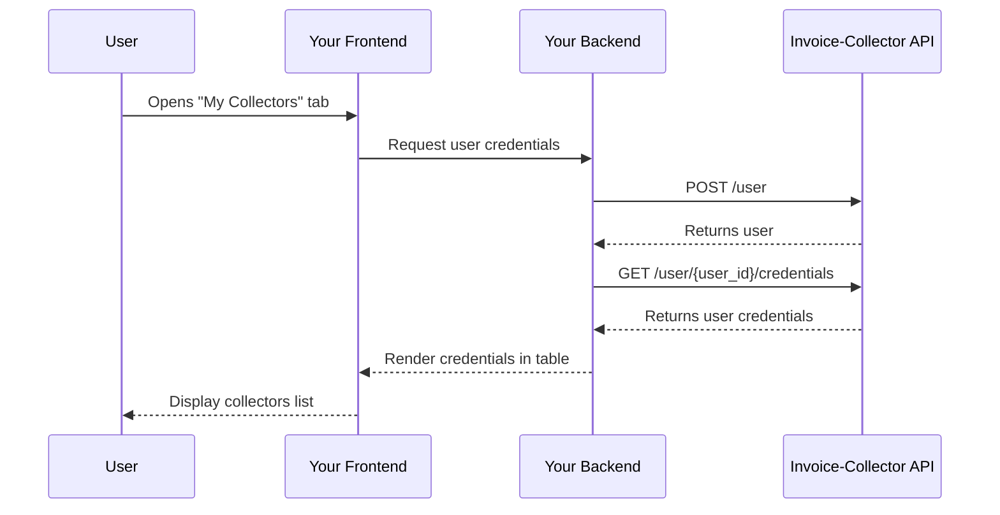

import Button from '@site/src/components/Button';

# 1. List credentials

When a user opens the "My Collectors" tab in your app, they should see:
- A list of all their configured credentials.
- The current status of each collector (active, error, needs authentication, etc...).
- Basic information about each collector (supplier name, account identifier).
- Options to manage their credentials (view, re-connect and delete).

Flow:
1. The first thing to do is to create the user in our database using the [`POST /user`](/docs/api.mdx#tag/User/paths/~1user/post) endpoint.
2. Then you can use the user `id` to get its credentials with the endpoint [`GET /user/{user_id}/credentials`](/docs/api.mdx#tag/Credential-(bearer)/paths/~1user~1{user_id}~1credentials/get).
3. Render the credentials on your frontend in a nice table.

Here is an example of what the table displayed on your frontend could look like:

 
 

    <Button label="Add collector" link="add-credential" />

 

    <table>
        <thead>
            <tr>
                <th>Supplier</th>
                <th>Status</th>
                <th>Creation date</th>
                <th>Last Collect</th>
                <th>Next Collect</th>
                <th>Documents collected</th>
                <th>Actions</th>
            </tr>
        </thead>
        <tbody>
            <tr>
                <td>Amazon Business</td>
                <td>Active</td>
                <td>2025-10-01</td>
                <td>2025-11-14</td>
                <td>2025-11-16</td>
                <td>46</td>
                <td>[Delete](delete-credential)</td>
            </tr>
            <tr>
                <td>Google Workspace</td>
                <td>In Progress</td>
                <td>2025-12-15</td>
                <td>-</td>
                <td>2025-12-15</td>
                <td>0</td>
                <td>
                    <button>[View collect](view-collect)</button>
                    <button>[Delete](delete-credential)</button>
                </td>
            </tr>
            <tr>
                <td>Office Depot</td>
                <td>Error - Wrong password</td>
                <td>2025-11-05</td>
                <td>2025-11-05</td>
                <td>-</td>
                <td>0</td>
                <td>[Delete](delete-credential)</td>
            </tr>
            <tr>
                <td>OpenAI</td>
                <td>Disconnected</td>
                <td>2025-08-21</td>
                <td>2025-10-30</td>
                <td>-</td>
                <td>21</td>
                <td>
                    <button>[Re-connect](reconnect-credential)</button>
                    <button>[Delete](delete-credential)</button>
                </td>
            </tr>
        </tbody>
    </table>

### Display actions depending on the collector state

When getting the credentials with the endpoint [`GET /user/{user_id}/credentials`](/docs/api.mdx#tag/Credential-(bearer)/paths/~1user~1{user_id}~1credentials/get),
you will see that each credential has a field called `state`. Actions displayed in the table depends on the `state.index` value.
See [Credential state](../credential-state) for more infos.
