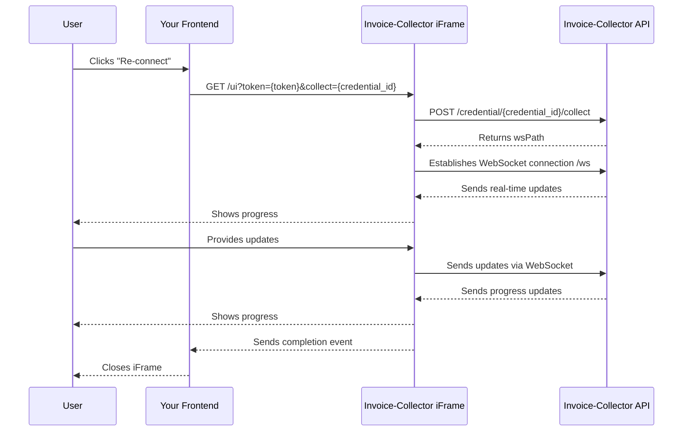
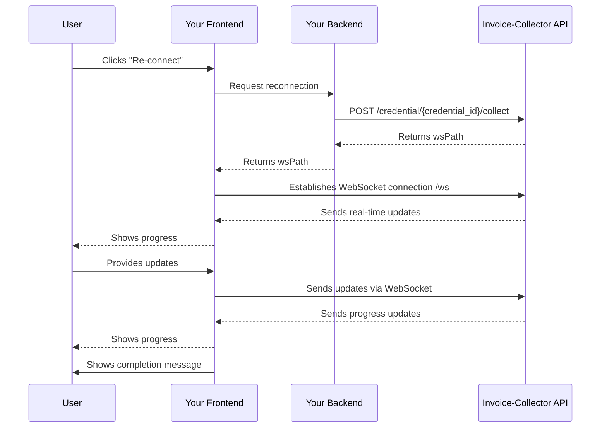

import Button from '@site/src/components/Button';
import Tabs from '@theme/Tabs';
import TabItem from '@theme/TabItem';

# 4. Re-connect a credential

When a credential becomes disconnected or encounters authentication issues, users need a way to re-authenticate and resume collection.
The reconnection process varies depending on your integration approach.

---

## 1. Iframe integration (Quick & Easy)

For iframe-based integrations, reconnecting a credential is straightforward.
When user clicks "Re-connect" button, simply open the iframe with url:
```javascript
/ui?token=${token}&collect=${credentialId}
```

The iframe will handle all the re-authentication steps automatically, including:
- Handling 2FA challenges
- Managing the collection process
- Providing real-time feedback to the user

**How it works:**



---

## 2. Full integration (Complete Control)

For full API integrations, you have complete control over the re-authentication flow.
The process is similar to adding a new credential, but starts with an existing credential.

**How it works:**



**What you need to implement:**

- Backend:
  - Call `POST /credential/{credential_id}/collect` to start the reconnection process and return `wsPath` to your frontend

- Frontend:
  - Create a page to display addition progress
  - Implement WebSocket connection `/ws` and events (state, screenshot, twofa, close)

### WebSocket Messages

The reconnection process uses the same WebSocket messages as credential addition:

**Messages Received from API:**

- **State** - Progress updates and state changes
- **Screenshot** - For interactive login when needed

**Messages Sent to API:**

- **Twofa** - Two-factor authentication code
- **Click** - Mouse click simulation during interactive login
- **Keydown** - Keyboard input during interactive login
- **Text** - Text input during interactive login
- **Close** - Complete interactive login session

For detailed information about WebSocket messages, refer to the [Websocket Messages](../websocket-messages) documentation.

---

## Common Scenarios

### 2FA & Session Expired

Some websites require 2FA for authentication. Cookies will be saved on first connection to authenticate on the next ones.
After few month, the token will expire and the user will have to re-authenticate.

- The credential `state.index` will go to `-2` and a `notification_disconnected` event will be sent to your callback.
- User is notified that the credential is disconnected and a re-authentication is required
- User clicks on "Re-connect"
