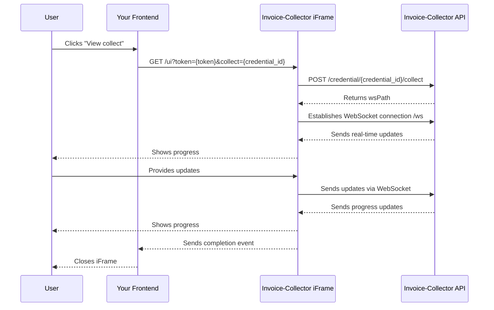
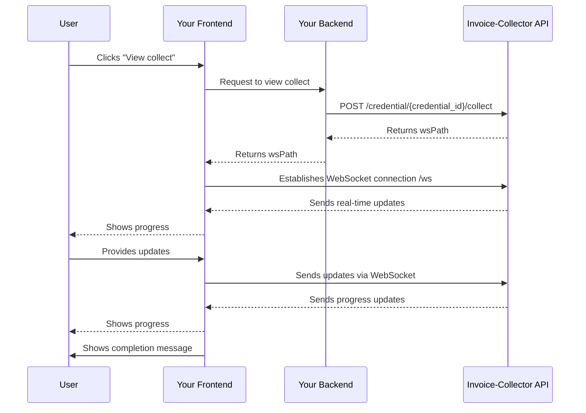

import Button from '@site/src/components/Button';
import Tabs from '@theme/Tabs';
import TabItem from '@theme/TabItem';

# 3. View a collect

When a credential addition is in progress, the user must be able to view an "In-progress" collect in order to enter 2FA code is needed.
The view collect process varies depending on your integration approach.

---

## 1. Iframe integration (Quick & Easy)

For iframe-based integrations, viewing a collect is straightforward.

### Implementation

<table>
    <thead>
        <tr>
            <th>Step</th>
            <th>Side</th>
            <th>Description</th>
        </tr>
    </thead>
    <tbody>
        <tr>
            <td>1</td>
            <td>Frontend</td>
            <td>User clicks on the "View collect" button.</td>
        </tr>
        <tr>
            <td>2</td>
            <td>Frontend</td>
            <td>Update the iframe `href` to `/ui?token=${token}&collect=${credentialId}` and display the iframe. The iframe will get the current addition process and directly display the progress bar.</td>
        </tr>
    </tbody>
</table>

:::warning[Warning]
Calling `/ui?token=${token}&collect=${credentialId}` if a collect is not in progress will trigger a new collect.
Make sure the current [credential state](../credential-states) if between `0` and `7` excluded.
:::

### How it works

---

## 2. Full integration (Complete Control)

For full API integrations, you have complete control over the view collect flow.
The process is similar to adding a new credential, but starts with an existing credential.

### Implementation

<table>
    <thead>
        <tr>
            <th>Step</th>
            <th>Side</th>
            <th>Description</th>
        </tr>
    </thead>
    <tbody>
        <tr>
            <td>1</td>
            <td>Frontend</td>
            <td>Create a page to display addition progress.</td>
        </tr>
        <tr>
            <td>2</td>
            <td>Frontend</td>
            <td>User clicks on the "View collect" button.</td>
        </tr>
        <tr>
            <td>3</td>
            <td>Backend</td>
            <td>Call [`POST /credential/{credential_id}/collect`](/docs/api.mdx#tag/Credential-(bearer)/paths/~1user~1{user_id}~1credential~1{credential_id}~1collect/post) to start the view collect and return `wsPath` to your frontend.</td>
        </tr>
        <tr>
            <td>4</td>
            <td>Frontend</td>
            <td>Implement WebSocket connection `/ws` and events (state, screenshot, twofa, close).</td>
        </tr>
    </tbody>
</table>

:::warning[Warning]
Calling `/credential/{credential_id}/collect` if a collect is not in progress will trigger a new collect.
Make sure the current [credential state](../credential-states) if between `0` and `7` excluded.
:::

### WebSocket Messages

The view collect process uses the same WebSocket messages as credential addition:

**Messages Received from API:**

- **State** - Progress updates and state changes
- **Screenshot** - For interactive login when needed

**Messages Sent to API:**

- **Twofa** - Two-factor authentication code
- **Click** - Mouse click simulation during interactive login
- **Keydown** - Keyboard input during interactive login
- **Text** - Text input during interactive login
- **Close** - Complete interactive login session

For detailed information about WebSocket messages, refer to the [Websocket Messages](../websocket-messages) documentation.

### How it works

---

## Common Scenarios

### User exits addition process before the end

During the addition process, a user can exit the page by reloading the page or closing the window.
If performed, the user looses the current addition progress bar and is not able to input 2FA code if required.

- User exits the addition process befrore it ends or before the 2FA input
- User clicks on "View collect"
